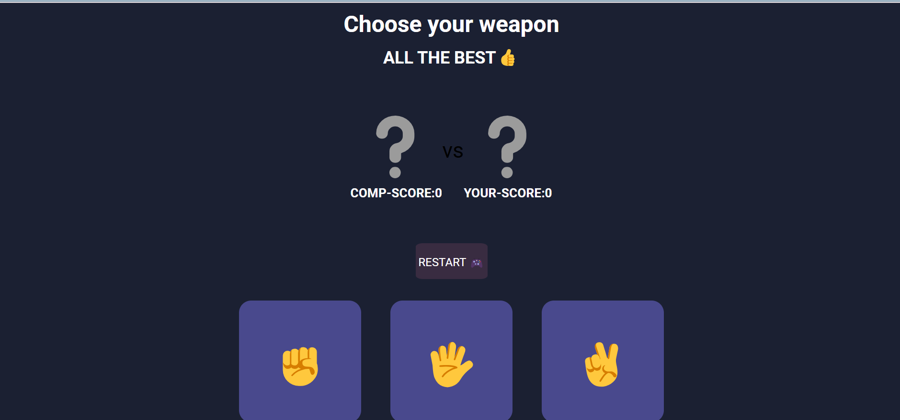

# Rock-Paper-Scissors Game

🎮 Overview

This is a simple Rock-Paper-Scissors game built using HTML, CSS, and JavaScript. The game allows a player to compete against the computer.

🚀 Features

1) Interactive UI with emojis for Rock (✊), Paper (🖐️), and Scissors (✌️)

2) Dynamic score tracking

3) Game reset button to restart at any time

4) Responsive design for mobile and desktop

🛠️ Technologies Used

HTML5

CSS3 (Flexbox, Grid, and Media Queries)

JavaScript (DOM Manipulation, Event Handling, Randomization)

📸 Screenshots

🎯 How to Play

Click on one of the three buttons: Rock (✊), Paper (🖐️), or Scissors (✌️).

The computer will randomly select one of the three options.

The winner is decided based on the standard game rules:

Rock beats Scissors

Scissors beats Paper

Paper beats Rock

Click the reset button to restart the game.

🔧 Setup & Installation

Clone this repository:

git clone git@github.com:Hiteshtripathi45/rock-paper-scissor-game.git

Navigate to the project folder:

cd rock-paper-scissors

Open index.html in your browser and start playing!

📜 License

This project is open-source and free to use for learning and personal projects.

---

Feel free to contribute or suggest improvements! 🚀